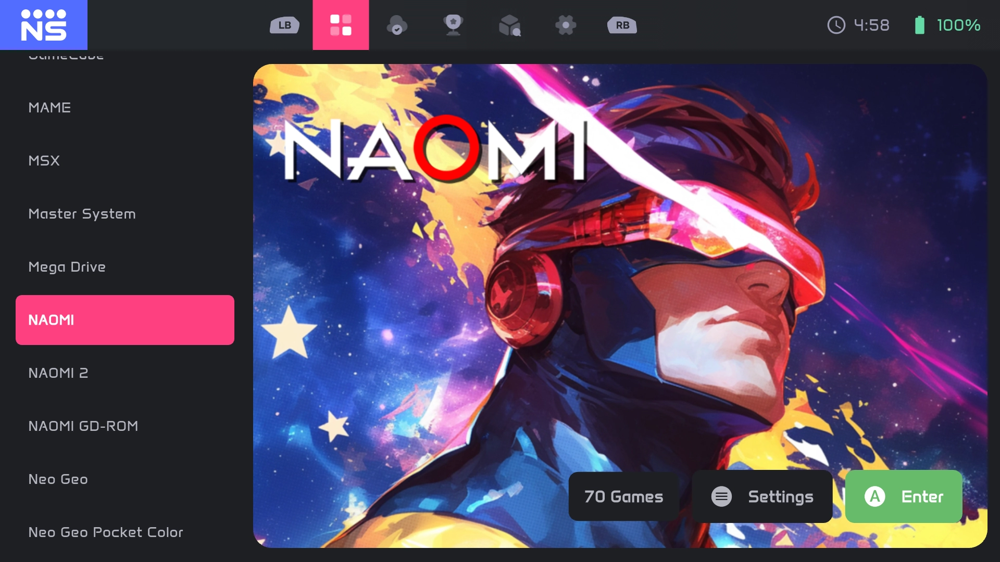

# NeoStation Systems

Welcome to the **NeoStation Systems** repository. This repository hosts the **open-source system configurations** used by **NeoStation**, a modern, free frontend designed to elevate your retro gaming experience.

🔗 **Website:** [https://neostation.dev](https://neostation.dev)

## 📂 Systems Configuration

The `systems` directory acts as the core database for emulator compatibility and execution arguments. It creates a standardized way to launch games across different platforms:
- **Android**
- **Windows**
- **Linux**
- **macOS**

Each file within this folder defines how NeoStation interacts with specific emulators and cores, ensuring a seamless "plug-and-play" experience.

## 🤝 Community & Contributions

This project thrives on community support! We encourage you to contribute by adding support for:
- New Emulators
- Additional RetroArch Cores
- Unlisted Systems

Your contributions help keep NeoStation up-to-date and versatile as the emulation landscape evolves. Feel free to open a Pull Request with your improvements.
